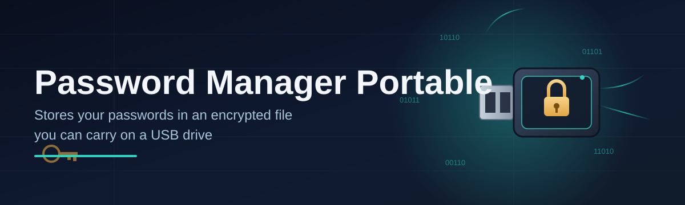
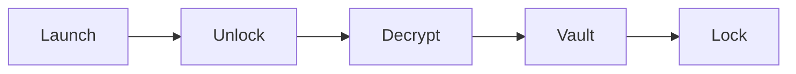

# password-manager-utility 🔐✨

  

*A pocket-sized vault for your passwords that runs anywhere, installs nowhere, and never phones home.*

  

---

## 🧭 Overview

**password-manager-utility** is a portable password manager built for people who move between machines — work laptop, home desktop, a borrowed PC at the library — without wanting to leave a trail of installed software or synced cloud accounts behind them. Drop the executable on a USB drive, a synced folder, or straight onto your desktop, and you have a self-contained vault that carries your credentials with you instead of tying them to one machine.

The portable password manager space is crowded with tools that promise simplicity but quietly demand background services, registry entries, or a subscription tier just to unlock basic vault features. This project takes the opposite stance: one file, one encrypted vault, zero footprint. There's no installer wizard, no telemetry pinging a server somewhere, and no dependency chain to untangle when something breaks. You launch it, you unlock it, you're done.

Whether you're a developer juggling dozens of API credentials, an IT technician who needs a trustworthy tool on client machines, or simply someone tired of browser-based password managers that leak autofill data across tabs, this utility is built for you. It's opinionated about privacy and minimalism, and it stays that way on purpose.

> [!NOTE]
> This README documents the 2026 release line. Older builds may behave differently — always grab the latest build from the landing page below.

  

---

## 🌟 What Makes It Tick

Here's the honest rundown of what you're actually getting — no marketing fluff, just capability:

- **Zero-install architecture** — the entire password manager lives in a single portable binary. Copy it, rename it, move it between drives; it behaves the same everywhere.

- **Local-first encryption** — your vault is encrypted at rest using industry-standard AES-256, and the decryption key never leaves your device or touches a network socket.

- **USB-friendly by design** — built and tested to run happily off flash drives, external SSDs, and cloud-synced folders like OneDrive or Dropbox, without corrupting the vault file mid-sync.

- **Master password gatekeeping** — one strong passphrase unlocks everything; there's no secondary cloud account, no email verification loop, no "forgot password" recovery flow that weakens your security model.

- **Searchable vault entries** — tag, categorize, and instantly filter hundreds of saved logins without scrolling through an unsorted list.

- **Password generator built in** — spin up high-entropy passwords with configurable length and character sets directly inside the app, no browser extension required.

- **Auto-lock on idle** — the vault seals itself after a configurable period of inactivity, so a forgotten unlocked window doesn't become a liability.

- **Portable export/import** — move your entire vault between versions or machines using an encrypted backup file, keeping your credential history intact.

> [!TIP]
> Keep your portable executable and its vault file on separate drives if you want an extra layer of physical separation — losing one doesn't mean losing the other.

---

## 🚀 Getting Rolling

Getting started takes less time than reading this section:

1. **Visit the landing page** using the download button above — that's the only official source for builds.

2. **Download the latest build** — it arrives as a single portable executable, no bundled installer.

3. **Run it directly** from wherever you saved it — desktop, USB stick, network share, doesn't matter.

4. **Set your master password** on first launch, and you're inside your new vault.

> [!IMPORTANT]
> Your master password is never stored anywhere. If you lose it, there is no backdoor recovery — that's the trade-off for true local encryption. Write it down somewhere safe.

---

## 🖥️ System Requirements

| Requirement | Minimum | Recommended |
|---|---|---|
| **OS** | Windows 10 (64-bit) | Windows 11 (64-bit) |
| **RAM** | 512 MB free | 2 GB free |
| **Disk** | 50 MB free space | 200 MB free space (for backups) |

No .NET runtime, no Java, no background services — the utility ships as a standalone Windows binary with everything it needs baked in.

 

---

## ⚙️ How It Works

Under the hood, the flow is deliberately simple — fewer moving parts means fewer things that can go wrong:

1. You launch the executable, and it looks for an existing vault file nearby (or offers to create one).

2. You enter your master password, which is run through a key-derivation function to produce the actual encryption key — this key exists only in memory, never on disk.

3. The vault file is decrypted in memory, entries are rendered in the UI, and every subsequent read/write is encrypted before it ever touches storage.

4. When you close the app or the idle timer fires, memory is wiped and the vault re-seals itself as an encrypted blob.

> [!WARNING]
> Editing the vault file directly with another program (text editors, hex viewers, sync conflict tools) can corrupt it beyond repair. Let the app be the only thing that touches that file.

---

## 🧩 Troubleshooting Corner

<strong>My vault won't unlock even though I'm sure the password is correct.</strong>

 

Check for trailing spaces or autocomplete interference from your OS. Also confirm the vault file wasn't partially synced (common with cloud-synced folders) — a half-written file will fail decryption every time.

<strong>Can I run this from a USB drive on a locked-down office PC?</strong>

 

Yes — that's the primary use case. Since it's portable and needs no admin install, it typically runs fine on restricted machines, though corporate policies vary and some environments block all unsigned executables regardless of portability.

<strong>I moved my vault file to a new computer and now nothing loads.</strong>

 

Make sure the executable and the vault file are in the same folder (or that the app's configured vault path still points to it). A mismatched path is the most common cause.

<strong>Does this sync across devices automatically?</strong>

 

No — and that's intentional. Sync it yourself via a cloud folder or USB drive if you want multi-device access, keeping full control over where your encrypted data actually lives.

<strong>The app flags my vault as "possibly corrupted." What now?</strong>

 

Restore from your most recent encrypted backup export. This is exactly why the built-in export/import feature exists — always keep at least one backup copy off the primary drive.

---

## 🎨 Interface & Everyday Feel

The UI aims for calm, uncluttered focus rather than dashboard overload:

- `Ctrl + L` — instantly lock the vault

- `Ctrl + F` — jump to search

- `Ctrl + N` — create a new entry

- `Ctrl + G` — generate a fresh password

- **Themes** — Light, Dark, and a high-contrast mode for accessibility

- **Settings panel** — configurable auto-lock timers, clipboard-clear delay, and font scaling

> [!TIP]
> Copied passwords clear from your clipboard automatically after a short delay — no need to manually overwrite it after pasting.

---

## 🤝 Contributing & Community

This project grows because people like you file issues, suggest features, and occasionally point out that a button is two pixels off. Contributions of all sizes are welcome — typo fixes, translations, UI polish, or deeper architecture discussions in the issue tracker.

> [!NOTE]
> Before opening a pull request, check existing issues to avoid duplicate effort — chances are someone's already discussing it.

If this portable password manager saved you a headache, consider starring the repo — it genuinely helps others discover a privacy-respecting alternative to bloated credential managers.

---

## 📜 License

Released under the [MIT License](LICENSE), 2026. Use it, fork it, build on it — just keep the license notice intact.

---

## ⚖️ Disclaimer

This software is provided "as is," without warranty of any kind. You are responsible for safeguarding your master password and maintaining your own backups. The maintainers are not liable for data loss resulting from misuse, file corruption, or forgotten credentials.

---

  

